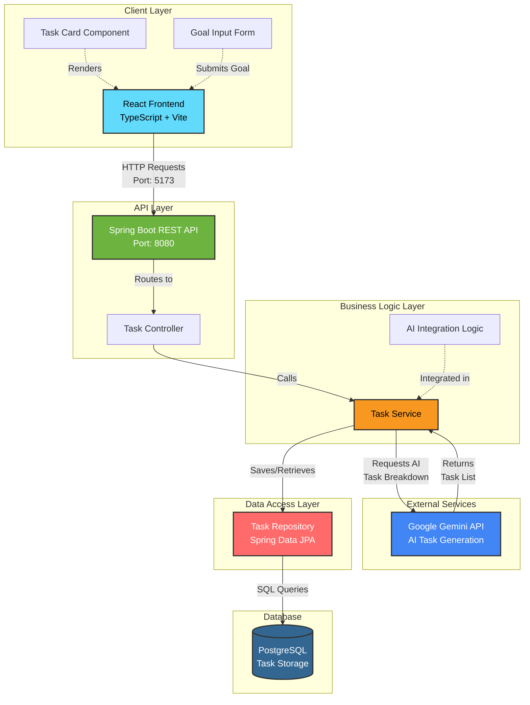

# SmartTaskPlanner 🎯

**Break user goals into actionable tasks with timelines using AI reasoning.**

SmartTaskPlanner is a full-stack application that leverages AI (Google Gemini) to intelligently decompose high-level goals into structured, time-bound, and dependency-aware tasks. Perfect for project planning, personal goal tracking, and task management.

---

## Video Link: https://youtu.be/mIs-oWbpg04

---

## 🌟 Features

- **AI-Powered Task Breakdown**: Automatically generates actionable tasks from high-level goals using Google Gemini API
- **Smart Timeline Management**: Ensures tasks fit within specified deadlines with relative time durations
- **Dependency Tracking**: Identifies and manages task dependencies
- **Modern UI**: Built with React, TypeScript, and Tailwind CSS
- **RESTful API**: Spring Boot backend with PostgreSQL database
- **Persistent Storage**: All tasks are saved to PostgreSQL for future reference

---

## 🏗️ Architecture



### System Architecture Overview

The SmartTaskPlanner follows a **layered architecture** pattern with clear separation of concerns:

1. **Client Layer (React Frontend)**
   - User interface built with React and TypeScript
   - Communicates with backend via REST API
   - Runs on Vite dev server (Port 5173)

2. **API Layer (Spring Boot)**
   - RESTful endpoints for task operations
   - Handles HTTP requests and responses
   - Runs on embedded Tomcat (Port 8080)

3. **Business Logic Layer**
   - Task orchestration and processing
   - Integration with Google Gemini AI
   - Business rules and validation

4. **Data Access Layer**
   - Spring Data JPA repositories
   - ORM mapping with Hibernate
   - Database abstraction

5. **Database Layer**
   - PostgreSQL for persistent storage
   - Stores generated tasks and dependencies

### Technology Stack

#### Backend (Spring Boot)
- **Framework**: Spring Boot 3.5.6
- **Java Version**: 21
- **Database**: PostgreSQL
- **Key Dependencies**:
  - Spring Data JPA
  - Spring Web
  - Spring WebFlux
  - PostgreSQL Driver

#### Frontend (React + Vite)
- **Framework**: React 18.3.1
- **Build Tool**: Vite 5.4.2
- **Language**: TypeScript
- **Styling**: Tailwind CSS
- **Icons**: Lucide React

---

## 📋 Prerequisites

Before you begin, ensure you have the following installed:

- **Java 21** or higher
- **Maven 3.6+**
- **Node.js 18+** and npm
- **PostgreSQL 12+**
- **Google Gemini API Key**

---

## 🚀 Getting Started

### 1. Clone the Repository

```bash
git clone https://github.com/rahulvarma2005/SmartTaskPlanner.git
cd SmartTaskPlanner
```

### 2. Database Setup

Create a PostgreSQL database:

```sql
CREATE DATABASE smarttaskplanner;
```

### 3. Backend Configuration

1. Navigate to `Smart Task Planner Backend/src/main/resources/`
2. Copy `application.properties.template` to `application.properties`:

```bash
cd "Smart Task Planner Backend"
copy src\main\resources\application.properties.template src\main\resources\application.properties
```

3. Edit `application.properties` with your configuration:

```properties
spring.application.name=SmartTaskPlanner

# PostgreSQL Database Configuration
spring.datasource.url=jdbc:postgresql://localhost:5432/smarttaskplanner
spring.datasource.username=your_db_username
spring.datasource.password=your_db_password
spring.jpa.hibernate.ddl-auto=update

# Gemini API Configuration
gemini.api.key=your_gemini_api_key_here
gemini.api.url=your_gemini_api_url_here
```

### 4. Start the Backend

Navigate to the backend directory and run:

```bash
cd "Smart Task Planner Backend"
mvnw.cmd spring-boot:run
```

Or if you have Maven installed globally:
```bash
mvn spring-boot:run
```

The backend will start on `http://localhost:8081`

### 5. Start the Frontend

Open a new terminal and navigate to the frontend directory:

```bash
cd "Smart Task Planner Frontend"
npm install
npm run dev
```

The frontend will start on `http://localhost:5173`

---

## 🧪 Running Tests

### Backend Tests

```bash
cd "Smart Task Planner Backend"
mvnw.cmd test
```

Or if you have Maven installed globally:
```bash
mvn test
```

### Frontend Tests

```bash
cd "Smart Task Planner Frontend"
npm run typecheck
npm run lint
```

---

## 📡 API Endpoints

### POST `/api/tasks/generate`

Generate tasks from a goal using AI.

**Request Body:**
```json
{
  "goal": "Create a mobile app in one month"
}
```

**Response:**
```json
[
  {
    "id": 1,
    "taskNumber": 1,
    "description": "Initial Planning",
    "deadline": "in 3 days",
    "dependencies": ""
  },
  {
    "id": 2,
    "taskNumber": 2,
    "description": "Design UI/UX",
    "deadline": "in 1 week",
    "dependencies": "Task #1"
  }
]
```

### GET `/api/tasks`

Retrieve all saved tasks.

---

## 📁 Project Structure

```
SmartTaskPlanner/
├── Smart Task Planner Backend/     # Spring Boot backend
│   ├── src/
│   │   ├── main/
│   │   │   ├── java/
│   │   │   │   └── com/planner/SmartTaskPlanner/
│   │   │   │       ├── SmartTaskPlannerApplication.java
│   │   │   │       ├── controller/
│   │   │   │       │   └── TaskController.java
│   │   │   │       ├── dto/
│   │   │   │       │   ├── GoalRequest.java
│   │   │   │       │   └── TaskResponse.java
│   │   │   │       ├── model/
│   │   │   │       │   └── Task.java
│   │   │   │       ├── repository/
│   │   │   │       │   └── TaskRepository.java
│   │   │   │       └── service/
│   │   │   │           └── TaskService.java
│   │   │   └── resources/
│   │   │       ├── application.properties
│   │   │       └── application.properties.template
│   │   └── test/
│   │       └── java/
│   │           └── com/planner/SmartTaskPlanner/
│   │               └── controller/
│   │                   └── TaskControllerTest.java
│   ├── pom.xml
│   ├── mvnw
│   └── mvnw.cmd
├── Smart Task Planner Frontend/    # React + Vite frontend
│   ├── src/
│   │   ├── components/
│   │   │   └── TaskCard.tsx
│   │   ├── App.tsx               # Main app component
│   │   ├── main.tsx              # Entry point
│   │   └── index.css
│   ├── package.json
│   ├── vite.config.ts
│   ├── tailwind.config.js
│   └── index.html
├── target/                         # Build output
└── README.md
```

---

## 🛠️ Technologies Used

### Backend
- Spring Boot 3.5.6
- Spring Data JPA
- Spring WebFlux (for API calls)
- PostgreSQL
- Maven
- Java 21

### Frontend
- React 18.3.1
- TypeScript 5.5.3
- Vite 5.4.2
- Tailwind CSS 3.4.1

### AI Integration
- Google Gemini API

---

## 👨‍💻 Author

**Rahul Varma**
- GitHub: [@rahulvarma2005](https://github.com/rahulvarma2005)

---

**Happy Planning! 🚀**
