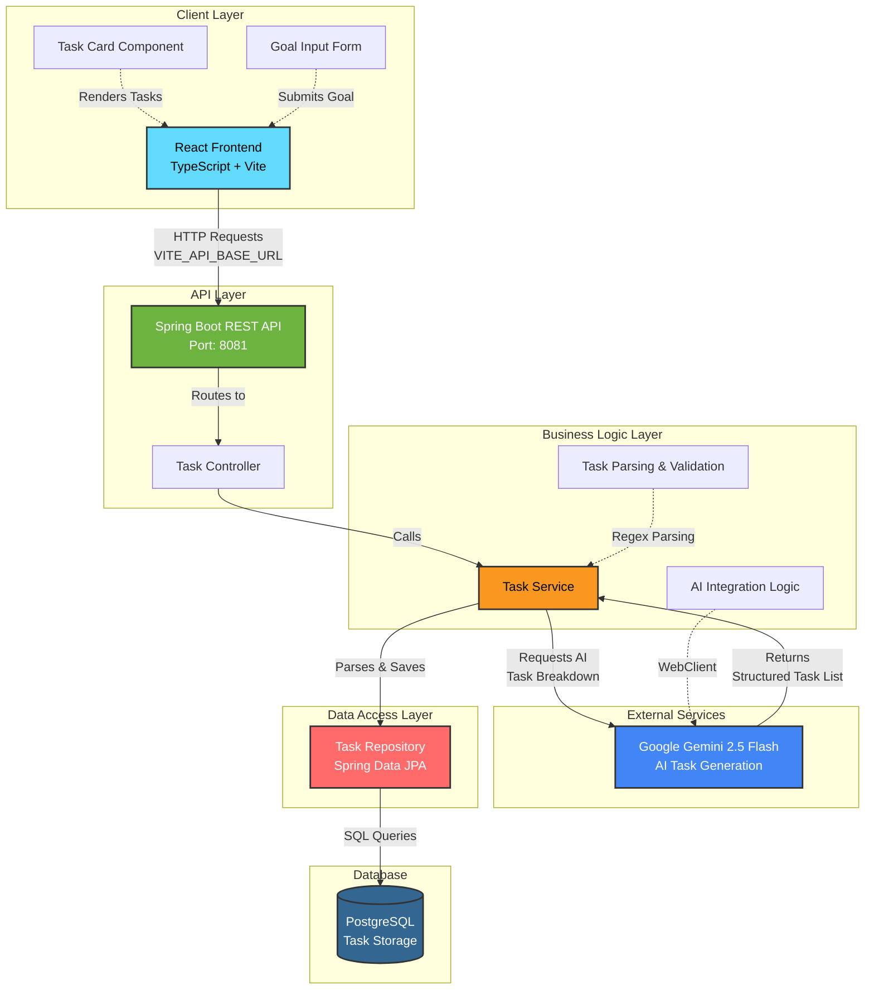

# SmartTaskPlanner 🎯

[](https://www.oracle.com/java/)
[](https://spring.io/projects/spring-boot)
[](https://reactjs.org/)
[](https://www.typescriptlang.org/)
[](https://www.postgresql.org/)
[](https://ai.google.dev/)

**Break user goals into actionable tasks with timelines using AI reasoning.**

SmartTaskPlanner is a full-stack application that leverages Google Gemini AI to intelligently decompose high-level goals into structured, time-bound, and dependency-aware tasks. Perfect for project planning, personal goal tracking, and task management.

🎥 **Demo Video** - [https://youtu.be/mIs-oWbpg04](https://youtu.be/mIs-oWbpg04)

🌐 **Live Demo** - [https://smart-task-planner-rahul.vercel.app/](https://smart-task-planner-rahul.vercel.app/)

---

## 🌟 Features

- ✨ **AI-Powered Task Breakdown**: Automatically generates actionable tasks using Google Gemini 2.5 Flash
- ⏱️ **Smart Timeline Management**: Ensures tasks fit within specified deadlines with relative time durations
- 🔗 **Dependency Tracking**: Identifies and manages task dependencies intelligently
- 🎨 **Modern UI**: Beautiful, responsive interface built with React, TypeScript, and Tailwind CSS
- 🚀 **RESTful API**: Robust Spring Boot backend with comprehensive error handling
- 💾 **Persistent Storage**: PostgreSQL database for reliable task storage
- ✅ **Task Completion Tracking**: Interactive UI to mark tasks as complete
- 🐳 **Docker Support**: Containerized deployment for both frontend and backend
- 📱 **Responsive Design**: Works seamlessly on desktop and mobile devices
- 🔐 **Environment-based Configuration**: Secure configuration management for different environments

---

## 🏗️ Architecture



### System Architecture Overview

The SmartTaskPlanner follows a **layered architecture** pattern with clear separation of concerns:

1. **Client Layer (React Frontend)**
   - User interface built with React 18.3.1 and TypeScript
   - Styled with Tailwind CSS for responsive design
   - Communicates with backend via REST API
   - Environment-based API URL configuration
   - Runs on Vite dev server (Port 5173 for development)

2. **API Layer (Spring Boot)**
   - RESTful endpoints for task operations
   - CORS enabled for cross-origin requests
   - Handles HTTP requests and responses
   - Runs on Port 8081 (configurable via PORT environment variable)

3. **Business Logic Layer**
   - Task orchestration and processing
   - Integration with Google Gemini AI via WebClient
   - Regex-based parsing of AI-generated task lists
   - Business rules and validation
   - Error handling and logging

4. **Data Access Layer**
   - Spring Data JPA repositories
   - ORM mapping with Hibernate
   - Database abstraction layer
   - Connection pooling with HikariCP

5. **Database Layer**
   - PostgreSQL for persistent storage
   - Stores tasks with descriptions, deadlines, and dependencies
   - Automatic schema updates via Hibernate

---

## 🤖 AI Prompt Template

The application uses a carefully crafted prompt template to ensure consistent and accurate task generation from Google Gemini AI:

```
You are a project manager AI. Your task is to break down a user's goal into a 
sequence of actionable tasks. The total duration of all tasks combined MUST NOT 
exceed the overall timeline specified in the goal. For each task, provide a 
relative deadline which MUST be a time duration (e.g., 'in 3 hours', 'in 5 days', 
'in 2 weeks'). **DO NOT** put anything else inside the parentheses. Strictly 
follow this format: [Task Number]. [Task Description] (deadline) [Depends on: Task #X]. 

Example for a 'one week' goal:
1. Initial Planning (in 1 day)
2. Design and Mockups (in 2 days) [Depends on: Task #1]

Now, apply this logic to the following goal: {goal}
```

### Key Prompt Features:
- **Structured Output**: Enforces specific format for easy parsing
- **Time Constraints**: Ensures tasks fit within the specified timeline
- **Dependency Management**: Automatically identifies task dependencies
- **Relative Deadlines**: Uses relative time expressions (in X days/weeks)
- **Clear Instructions**: Minimizes ambiguity in AI responses

---

## 📋 Prerequisites

Before you begin, ensure you have the following installed:

- **Java 21** or higher
- **Maven 3.6+** 
- **Node.js 18+** and npm
- **PostgreSQL 12+**
- **Google Gemini API Key**
- **Git** for version control

---

## 🚀 Getting Started

### 1. Clone the Repository

```bash
git clone https://github.com/rahulvarma2005/SmartTaskPlanner.git
cd SmartTaskPlanner
```

### 2. Database Setup

Create a PostgreSQL database:

```sql
CREATE DATABASE smarttaskplanner;
```

### 3. Backend Configuration

1. Navigate to `Smart Task Planner Backend/src/main/resources/`
2. Copy `application.properties.template` to `application.properties`:

```bash
cd "Smart Task Planner Backend"
copy src\main\resources\application.properties.template src\main\resources\application.properties
```

3. Edit `application.properties` with your configuration:

```properties
spring.application.name=SmartTaskPlanner

# Server Configuration
server.port=${PORT:8081}

# PostgreSQL Database Configuration
spring.datasource.url=${DATABASE_URL:jdbc:postgresql://localhost:5432/smarttaskplanner}
spring.datasource.username=${DB_USERNAME:your_username}
spring.datasource.password=${DB_PASSWORD:your_password}
spring.jpa.hibernate.ddl-auto=update
spring.jpa.properties.hibernate.dialect=org.hibernate.dialect.PostgreSQLDialect

# Connection Pool Settings
spring.datasource.hikari.maximum-pool-size=5
spring.datasource.hikari.minimum-idle=2

# Gemini API Configuration
gemini.api.key=${GEMINI_API_KEY:your_gemini_api_key_here}
gemini.api.url=${GEMINI_API_URL:https://generativelanguage.googleapis.com/v1beta/models/gemini-2.5-flash:generateContent}

# Gemini Prompt Template (configured in application.properties)
gemini.api.prompt.template=You are a project manager AI...
```

### 4. Frontend Configuration

1. Navigate to `Smart Task Planner Frontend/`
2. Create `.env` file:

```bash
cd "Smart Task Planner Frontend"
copy .env.example .env
```

3. Edit `.env` with your backend URL:

```env
# For local development
VITE_API_BASE_URL=http://localhost:8081

# For production (after deploying backend)
# VITE_API_BASE_URL=https://your-backend-url.onrender.com
```

> **Note:** All Vite environment variables must be prefixed with `VITE_`

### 5. Start the Backend

Navigate to the backend directory and run:

```bash
cd "Smart Task Planner Backend"
mvnw.cmd spring-boot:run
```

Or if you have Maven installed globally:
```bash
mvn spring-boot:run
```

The backend will start on `http://localhost:8081`

### 6. Start the Frontend

Open a new terminal and navigate to the frontend directory:

```bash
cd "Smart Task Planner Frontend"
npm install
npm run dev
```

The frontend will start on `http://localhost:5173`

---

## 📡 API Endpoints

### POST `/api/tasks/generate`

Generate tasks from a goal using AI.

**Request:**
```bash
POST http://localhost:8081/api/tasks/generate
Content-Type: application/json

{
  "goal": "Create a mobile app in one month"
}
```

**Request Body:**
```json
{
  "goal": "Create a mobile app in one month"
}
```

**Response:**
```json
[
  {
    "id": 1,
    "taskDescription": "Define app requirements and target audience",
    "deadline": "in 3 days",
    "status": "To Do",
    "dependencies": null
  },
  {
    "id": 2,
    "taskDescription": "Create wireframes and UI/UX design",
    "deadline": "in 5 days",
    "status": "To Do",
    "dependencies": "Depends on: Task #1"
  }
]
```

---

## 📁 Project Structure

```
SmartTaskPlanner/
├── Smart Task Planner Backend/           # Spring Boot backend
│   ├── src/
│   │   ├── main/
│   │   │   ├── java/
│   │   │   │   └── com/planner/SmartTaskPlanner/
│   │   │   │       ├── SmartTaskPlannerApplication.java
│   │   │   │       ├── controller/
│   │   │   │       │   └── TaskController.java
│   │   │   │       ├── dto/
│   │   │   │       │   ├── GoalRequest.java
│   │   │   │       │   └── TaskResponse.java
│   │   │   │       ├── model/
│   │   │   │       │   └── Task.java
│   │   │   │       ├── repository/
│   │   │   │       │   └── TaskRepository.java
│   │   │   │       └── service/
│   │   │   │           └── TaskService.java
│   │   │   └── resources/
│   │   │       ├── application.properties
│   │   │       └── application.properties.template
│   │   └── test/
│   │       └── java/
│   │           └── com/planner/SmartTaskPlanner/
│   │               └── controller/
│   │                   └── TaskControllerTest.java
│   ├── .dockerignore
│   ├── Dockerfile                        # Multi-stage Docker build
│   ├── pom.xml                           # Maven dependencies
│   ├── mvnw & mvnw.cmd                   # Maven wrapper
│   └── RENDER_DEPLOYMENT.md              # Render deployment guide
│
├── Smart Task Planner Frontend/          # React + Vite frontend
│   ├── src/
│   │   ├── components/
│   │   │   └── TaskCard.tsx              # Task card component
│   │   ├── App.tsx                       # Main app component
│   │   ├── main.tsx                      # Entry point
│   │   └── index.css                     # Global styles
│   ├── .env                              # Environment variables (gitignored)
│   ├── .dockerignore
│   ├── Dockerfile                        # Multi-stage Docker build
│   ├── package.json                      # npm dependencies
│   ├── vite.config.ts                    # Vite configuration
│   ├── tailwind.config.js                # Tailwind CSS config
│   ├── tsconfig.json                     # TypeScript config
│   ├── ENV_VARIABLES.md                  # Environment variable docs
│   └── QUICK_START.md                    # Quick start guide
│
├── .idea/                                # IntelliJ IDEA project files
├── target/                               # Build output (gitignored)
├── Smart Task Planner Demo Video.mp4     # Demo video
└── README.md                             # This file
```

---

## 🛠️ Technologies Used

### Backend Stack
| Technology | Version | Purpose |
|------------|---------|---------|
| Java | 21 | Programming language |
| Spring Boot | 3.5.6 | Application framework |
| Spring Data JPA | 3.5.6 | Data persistence |
| Spring Web | 3.5.6 | REST API |
| Spring WebFlux | 3.5.6 | Reactive HTTP client for Gemini API |
| Spring Boot Actuator | 3.5.6 | Health checks & monitoring |
| PostgreSQL | 12+ | Database |
| Hibernate | 6.4.x | ORM framework |
| Lombok | Latest | Reduce boilerplate code |
| Maven | 3.6+ | Build tool |

### Frontend Stack
| Technology | Version | Purpose |
|------------|---------|---------|
| React | 18.3.1 | UI framework |
| TypeScript | 5.5.3 | Type-safe JavaScript |
| Vite | 5.4.2 | Build tool & dev server |
| Tailwind CSS | 3.4.1 | Utility-first CSS framework |
| Lucide React | 0.344.0 | Icon library |
| PostCSS | 8.4.35 | CSS processing |
| Autoprefixer | 10.4.18 | CSS vendor prefixing |
| ESLint | 9.9.1 | Code linting |

### AI Integration
| Service | Model | Purpose |
|---------|-------|---------|
| Google Gemini | 2.5 Flash | Task generation & decomposition |

### DevOps & Deployment
| Tool | Purpose |
|------|---------|
| Docker | Containerization |
| Render | Cloud hosting (backend) |
| PostgreSQL on Render | Managed database |
| Git | Version control |

---

## 🐳 Docker Deployment

### Backend Docker

The backend uses a multi-stage Docker build for optimized image size:

```dockerfile
# Build stage - Uses JDK 21
FROM eclipse-temurin:21-jdk-alpine AS build
# ... build process ...

# Runtime stage - Uses JRE 21 (smaller)
FROM eclipse-temurin:21-jre-alpine
# ... runtime setup ...
```

**Build and run:**
```bash
cd "Smart Task Planner Backend"
docker build -t smarttaskplanner-backend .
docker run -p 8081:8081 \
  -e DATABASE_URL=your_db_url \
  -e GEMINI_API_KEY=your_api_key \
  smarttaskplanner-backend
```

### Frontend Docker

The frontend uses Nginx for production serving:

```dockerfile
# Build stage - Node.js build
FROM node:20-alpine AS builder
# ... build process ...

# Runtime stage - Nginx serving
FROM nginx:alpine
# ... serve static files ...
```

**Build and run:**
```bash
cd "Smart Task Planner Frontend"
docker build -t smarttaskplanner-frontend .
docker run -p 80:80 smarttaskplanner-frontend
```

---

## 🚀 Deployment

### Deploy to Render

#### Backend Deployment

1. **Push code to GitHub**
2. **Create Web Service on Render:**
   - Connect your GitHub repository
   - Select "Docker" as runtime
   - Set root directory: `Smart Task Planner Backend`
   - Add environment variables:
     - `GEMINI_API_KEY`
     - `DATABASE_URL` (from Render PostgreSQL)
     - `PORT` (automatically set by Render)

3. **Create PostgreSQL Database:**
   - Create PostgreSQL instance on Render
   - Connect to web service

For detailed instructions, see [`Smart Task Planner Backend/RENDER_DEPLOYMENT.md`](./Smart%20Task%20Planner%20Backend/RENDER_DEPLOYMENT.md)

#### Frontend Deployment

1. **Build the frontend:**
```bash
npm run build
```

2. **Deploy to Render/Vercel/Netlify**
   - Set environment variable: `VITE_API_BASE_URL` to your backend URL

---

## 🗺️ Roadmap

Future enhancements planned:

- [ ] User authentication and authorization
- [ ] Task editing and deletion features
- [ ] Multiple project management
- [ ] Task progress tracking with percentage
- [ ] Calendar integration
- [ ] Email notifications for deadlines
- [ ] Export tasks to PDF/CSV
- [ ] Mobile app version
- [ ] Real-time collaboration features
- [ ] Integration with other project management tools

---

**Made with ❤️ by Rahul Varma**
